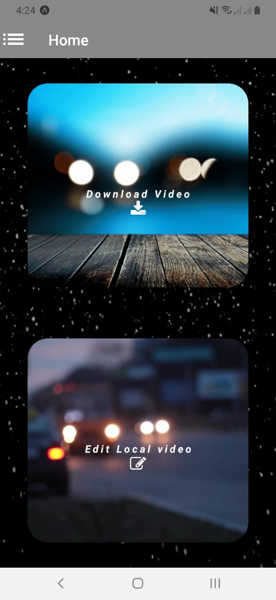
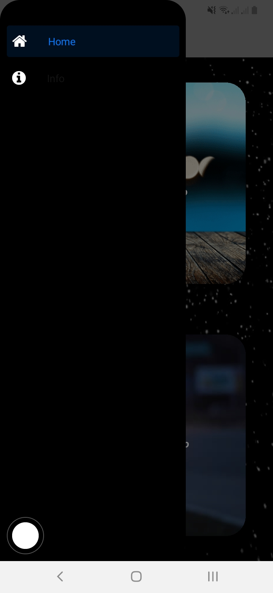
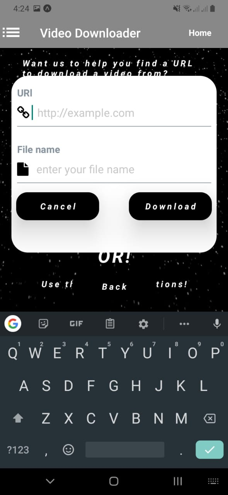

<h1>Video-Downloader app</h1>
<h2>A mobile application to download videos from any url or social media</h2>
<h3>The application requires the following dependencies</h3>
<ul>
  <li>The expo filesystem</li>
  <li>The axios and fetch</li>
  <li>The expo video</li>
  <li>The react navigation 5</li>
  <li>The react elements<li>
  <li>A backened node.js server support</li>
</ul>

